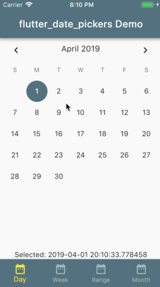

# flutter_date_pickers

Allows to use date pickers without dialog.
Provides some customizable styles for date pickers.

A set of date pickers:
   * `DayPicker` for one day
   * `WeekPicker` for whole week
   * `RangePicker` for random range
   * `MonthPicker` for month



## How to style date picker
Every date picker constructor take a style object as a parameter (if no styles passed - defaults will be used)
For single value pickers (DayPicker, MonthPicker) it is object DatePickerStyles;
For range pickers (WeekPicker, RangePickers) it is object DatePickerRangeStyles;

Customizable styles:
for all date pickers
TextStyle displayedPeriodTitle - title of the date picker
TextStyle currentDateStyle - style for current date
TextStyle disabledDateStyle - style for disabled dates (before first and after last date user can pick)
TextStyle selectedDateStyle - style for selected date
TextStyle defaultDateTextStyle - style for date which is neither current nor disabled nor selected
BoxDecoration selectedSingleDateDecoration - decoration for selected date in case single value is selected

only for range date pickers (WeekPicker, RangePicker)
BoxDecoration selectedPeriodStartDecoration - decoration for the first date of the selected range.
BoxDecoration selectedPeriodLastDecoration - decoration for the first date of the selected range.
BoxDecoration selectedPeriodMiddleDecoration - Decoration for the date of the selected range which is not first date and not end date of this range.


## Usage

```dart
// Create week date picker with passed parameters
Widget buildWeekDatePicker (DateTime selectedDate, DateTime firstAllowedDate, DateTime lastAllowedDate, ValueChanged<DatePeriod> onNewSelected) {
  return WeekPicker(
      selectedDate: selectedDate,
      onChanged: onNewSelected,
      firstDate: firstAllowedDate,
      lastDate: lastAllowedDate
  );
}
```

For help getting started with Flutter, view our
[online documentation](https://flutter.io/docs), which offers tutorials,
samples, guidance on mobile development, and a full API reference.